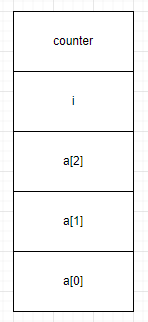

# 0. 介绍

介绍数组围绕以下几点：

**数组有序性**

数组中的数据在内存中顺序存储。CPU 通过 `arr[k]_address = base_address + k * offset` 访问内存中第 k+1 个数组数据。其中，offset 是元素的偏移量。

为什么是 k+1 个数据而不是 k 个呢？  

第一：数组元素是从 `k=0` 下标为 0 开始的，base_address 既是第一个数组元素的地址。  
第二：为何将 0 作为数组中第一个元素的下标。因为 base_address 指向的是第一个数组元素的地址，而 k 是访问下标，如果数组下标从 1 开始，上面的 CPU 访问公式就成了  `arr[k]_address = base_address + （k-1） * offset`。可以看到，相比之下，多了一次 k-1 运算。  
第三：设计程序语言的历史原因。  

参考 [数组：为什么很多编程语言中数组都从 0 开始编号](https://time.geekbang.org/column/article/40961)

**元素有序性**

数组在内存中的结构是有序的。那么，数组元素是否也能有序呢？  
可以的。由于数组结构有序，在程序设计过程中，可以利用这种有序性将有序元素顺序存储在数组中。比如，将 timestamp 按先后顺序存储在数组中。

那么，在知道数组长度 n 的情况下，可以直接读取 a[n] 获得最后更新的 timestamp，时间复杂度为 O(1)。非常方便。

**空间有序性**

空间有序性指的是数组在内存中空间的存储，侧重的是空间利用率。  
我们知道内存中函数调用，是通过开辟函数栈，接着将函数中元素顺序压栈，出栈，实现函数的调用和返回。

数组在内存中是怎么存储的呢？  

我们看以下代码：
```
int main(int argc, char* argv[]){
    int counter = 0;

    int i = 0;
    //int counter = 0;
    int arr[3] = {0};

    
    for(; i<=3; i++){
        arr[i] = 0;
        printf("hello world\n");

        counter++;
        if (counter == 4)
        {
                break;
        }
    }

    printf("%d", i);
    return 0;
}
```

这段 C 语言代码将打印 i 为 0，而不是 4。为什么会这样呢？我们逐行分析。

首先，调用 main 函数，压栈。栈地址由高到低压入 counter，i 和 arr 数组。注意数组大小为 3，内存中占用 `3 * sizeOf(int)` 字节，且数组元素 arr[0] 对应的是低地址。画出内存栈如下：  



可以看出，i 的地址既是 arr[3] 的地址，由于 C 语言不会对数组越界进行处理，这里数组访问越界到 `arr[3]=0`，实际赋值的是 `i=0`。因此，打印 i 为 0，而不是 4。  

这里压栈的顺序也有讲究，改造代码如下：
```
int main(int argc, char* argv[]){
    int i = 0;
    int counter = 0;
    int arr[3] = {0};

    //int counter = 0;
    for(; i<=3; i++){
        arr[i] = 0;
        printf("hello world\n");

        counter++;
        if (counter == 5)
        {
                break;
        }
    }

    printf("%d", i);
    printf("%d", counter);
    return 0;
}
```

请分析代码输出结果。

相应地，在 Go 中执行这段代码将报错如下：
```
panic: runtime error: index out of range [3] with length 3

goroutine 1 [running]:
main.main()
        /root/go/src/algorithm/array/array.go:9 +0x88
exit status 2
```

数组在栈上连续存储，当存储的元素很多时用数组来存储元素是不适用的，可能会导致栈内存溢出。

那么，当元素很多时可以用什么存储呢？

**复杂度分析**

数组是一种数据结构，这种数据结构组成的资源叫做 resource。既是 resource，就有对 resource 的增删改查，那么对数组这种 resource 的增删改查复杂度是多少呢？

直接给出复杂度在分析：  

| 数组        | 时间复杂度   | 空间复杂度 |
| ----------- | ----------- | --------- |
| 插入、删除   | O(n)        | O(1)      |
| 查找        | O(1)        | O(1)      |

*插入、删除复杂度*

由于数组中数据存储连续这一特性，当对数组插入、删除时要对其它数据进行移动以保证数据连续。  
最好的情况是，在数组末尾插入、删除数据，这时其它数据不用动，最好情况复杂度为 O(1)。最坏情况是插入、删除数组第一个数据，那么后面的数据都将移动，最坏情况复杂度为 O(n)。

平均复杂度就有意思了，和插入，删除位置相关，建立各个位置和搬移次数的映射得到平均搬移次数如下：  
`(1 + 2 + ... + n) / n = (n+1/2)`，得到平均时间复杂度为 O(n)。  


这里有一种情况要讨论的是，如果对数组数据无要求的情况下，插入、删除可以用交换来操作，而不是搬移。这样的复杂度变成 O(1) 了。  
比如，在数组 `[1, 2, 3, 4, 5, 0, 0]` 第三个元素 [2] 处插入数据 6，可以将原来 [2] 中的数据和数组末尾做调换为 `[1, 2, 6, 4, 5, 3, 0]`。这时只需进行一次调换操作。  
同样地，删除的交换操作也是类似。  

*查找*

查找要区分的是指定数据下标的查找，还是指定数据的查找。  

指定数据下标的查找，比如查找第 k 个数据，则根据 `arr[k]_address = base_address + k * offset` 通过一次运算得出第 k 个数据的地址，时间复杂度为 O(1)。  
指定数据的查找。比如查找数组中数据为 3 的元素，则需要遍历数组查找，时间复杂度为 O(n)。  


# 1. 小结
- [ ] 关于函数栈调用和数据的压栈出栈，后续还需带着问题深入理解。
- [ ] 数组数据的删除和垃圾回收算法。