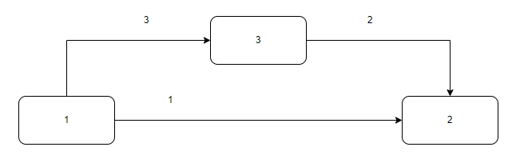

## 0. 介绍
链表是一种线性数据结构，每个结点串联组成了链表，链表中的结点通过结点指针访问。  
链表在内存中的数据存储不连续，占用的内存空间较数组更多（结点中包括指针域）。

链表有多种类型，单链表，单循环链表，双向链表，双向循环链表：
- 单链表：从头结点开始单向访问，且尾结点指向 `nil` 的链表。
- 单循环链表：单向的链表环，尾结点指向头结点。
- 双向链表：结点由数据和前后指针域组成，尾结点的后指针和头结点的前指针指向 `nil`。
- 双向循环链表：双向链表环。

## 1. 复杂度分析
### 1.1 链表的增删改查
**增加结点**   


增加(插入)链表结点要注意的是：
1. 查找链表，找到在哪里插入结点。
2. 插入结点的顺序不能乱，如上图步骤 1， 2， 3 所示。

**删除结点**  
类似于插入结点，删除结点要找的是删除哪个结点，删除哪个结点可以从两个维度看：
1. 删除的结点是唯一的，比如删除链表中第 K 个结点。
2. 删除的结点不唯一，比如删除链表中元素为 n 的结点。

不管是哪种，遍历链表都是需要的。

**改结点**  
改(更新)结点类似删除结点，要找的是更新哪个结点。

**查找结点**  
可以发现，前面的操作都离不开查找。查找根据指针遍历链表找出满足条件的结点。

### 1.2 复杂度分析

| 链表            | 时间复杂度   |
| -----------    | ----------- |
| 插入(无查找)    |   O(1)      |
| 插入(查找)      |  O(n)       |
| 删除(无查找)    |  O(1)       |
| 删除(查找)      |  O(n)       |
| 查找            |  O(1)       |

### 1.3 链表实现
链表实现有以下几点要注意：
- 哨兵结点：某些操作链表的头结点和其它结点的操作不一样，这时候为保持代码简洁，可增加哨兵结点使得头结点和其它结点的操作保持一致。
- 边界条件：链表的边界条件是写好一个链表的关键。

## 2. LeetCode 链表
LeetCode 上有不少链表题，我们找了几个加深对链表的理解。

### 2.1 **[反转链表](https://leetcode.cn/problems/reverse-linked-list/)**

反转链表可以从两个思路入手：交换数据和反转指针。

**交换数据**  
1. 通过指针指向要交换的数据，接着对数据进行交换。这种方法的时间复杂度为 O(n^2)，空间复杂度为 O(1)。
2. 引入栈空间，将链表数据添加到栈空间。这里利用了栈空间数据存储连续性这一特性，接着交换栈空间和链表的数据。这种方法的时间复杂度为 O(n),空间复杂度为 O(1)。

**反转指针**  
1. 使用快慢指针反转链表的指针。需要注意的是需要提前将下个结点的地址存储起来，否则反转之后将找不到下个结点的地址。实现代码如下：
```
for cur := head; cur != nil; cur = temp {
    temp = cur.Next
    cur.Next = pre
    pre = cur
}
```

这里有个实现小细节在于，返回的反转尾结点是 `pre` 而非 `cur`。

### 2.2 **[回文链表](https://leetcode.cn/problems/aMhZSa/)**

回文链表不同于反转链表，它是对链表中的数据做文章。
那么同样地，可以利用栈空间将链表数据添加到栈，接着比较栈和链表数据判断链表是否回文。这里要注意的是比较链表的前半部分即可，不需要遍历比较所有链表数据。

上述解法是引入栈空间的解法，其时间复杂度为 O(n)，空间复杂度为 O(n)。

如果将空间复杂度降为 O(1)该怎么做呢？  
首先，链表结构不变，要比较的是链表前半部分和后半部分，那么可以以中间结点为分隔点，将链表分隔为前链表和后链表，后链表对链表后半部分进行反转。
反转之后就可以通过头尾指针对链表前半部分和后半部分进行比较了。

有一点要注意的是，由于此种解法会改变链表的结构，对于并发访问的场景，需要对链表加锁，同时链表比较完之后还需还原链表。

使用上述解法的时间复杂度为 O(n)，空间复杂度为 O(1)。

### 2.3 **[环形链表](https://leetcode.cn/problems/linked-list-cycle/)**

首先想到的是引入栈空间，将链表的结点添加到栈空间，通过查找下一个结点和栈空间已存的结点做比较。如果下一个结点已经存在则是环形链表。
这种解法的时间复杂度为 O(n)，空间复杂度为 O(n)。

接着这个解法就不好想了，这种解法的思路是使用两个快慢指针遍历链表，慢指针走一步，快指针走两步。在慢指针未走完一圈时，快慢指针将会相遇。

*思考：为何慢指针未走完一圈，指针将相遇？*

这种解法的时间复杂度为 O(n)，空间复杂度为 O(1)。  
其中有一点要注意的是快慢指针的起点。
```
slow, fast := head, head.Next
for fast != nil && fast.Next != nil {
    fast = fast.Next.Next
    slow = slow.Next
    if fast == slow {
        break
    }
}

return slow == fast
```

### 2.4 **[环形链表2](https://leetcode.cn/problems/linked-list-cycle-ii/)**

环形链表的变体是求入环的结点。这种使用数学归纳法很难看出规律，必须跳出来看从数学公式的角度看，围绕着快慢指针相遇时，快指针走了慢指针的一倍来构建公式。  

通过公式推导得出环长和相遇点的关系。  

这种解法的时间复杂度为 O(n)，空间复杂度为 O(1)。

### 2.5 **[相交链表](https://leetcode.cn/problems/intersection-of-two-linked-lists/)**

相交链表需要点发散思维，跳出来看将两个链表构造成环形链表，继而将找相交点变成了找环形链表的入环点，即变成 [环形链表2](https://leetcode.cn/problems/linked-list-cycle-ii/) 的解法。

